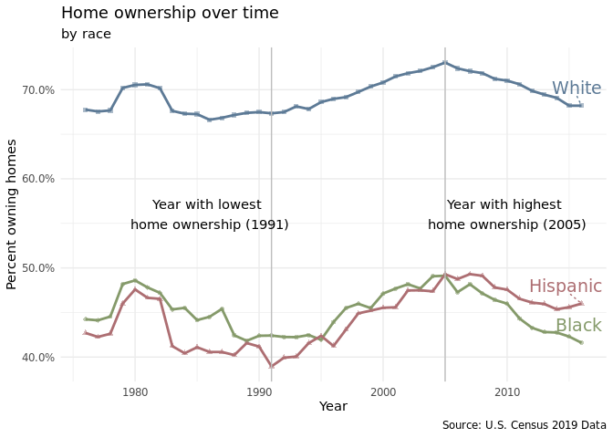
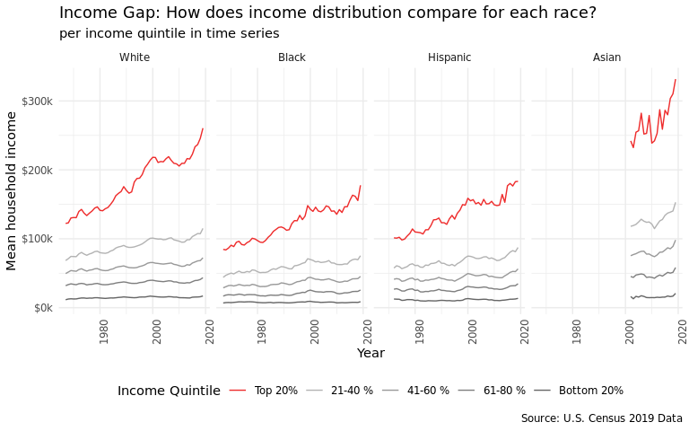
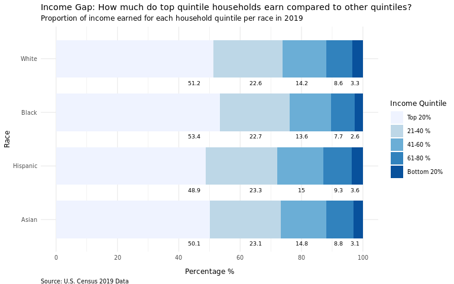

Wealth Inequality and Vibesssss
================
7-UP

## Introduction

(1-2 paragraphs) Brief introduction to the dataset. You may repeat some
of the information about the dataset provided in the introduction to the
dataset on the TidyTuesday repository, paraphrasing on your own terms.
Imagine that your project is a standalone document and the grader has no
prior knowledge of the dataset.

The dataset comes from the Urban Institute and US Census and focuses on
racial wealth inequality. We chose this dataset because wealth
inequality is a very important issue in America, and it would be
valuable to see the relationship between race and wealth over time in
America. There are around 5-6 data files focused on the relationship
between race and income over time. There are also important files on the
relationship between race and retirement, homeownership, and student
debt.

## How has home-ownership changed over time, and how does this trend vary between different races?

### Introduction

(1-2 paragraphs) Introduction to the question and what parts of the
dataset are necessary to answer the question. Also discuss why you’re
interested in this question.

We first wanted to investigate how home ownership has changed over time,
and among different racial groups. We decided to use the `home_owner`
dataset and use the `year`, `race`, and `home_owner_pct` variables.

### Approach

(1-2 paragraphs) Describe what types of plots you are going to make to
address your question. For each plot, provide a clear explanation as to
why this plot (e.g. boxplot, barplot, histogram, etc.) is best for
providing the information you are asking about. The two plots should be
of different types, and at least one of the two plots needs to use
either color mapping or facets.

### Analysis

(2-3 code blocks, 2 figures, text/code comments as needed) In this
section, provide the code that generates your plots. Use scale functions
to provide nice axis labels and guides. You are welcome to use theme
functions to customize the appearance of your plot, but you are not
required to do so. All plots must be made with ggplot2. Do not use base
R or lattice plotting functions.

#### Plot 1.a

<!-- -->

### Discussion

(1-3 paragraphs) In the Discussion section, interpret the results of
your analysis. Identify any trends revealed (or not revealed) by the
plots. Speculate about why the data looks the way it does.

## What does household income level look like for each racial group over time, and how do household income disparities compare among different racial groups?

### Introduction

(1-2 paragraphs) Introduction to the question and what parts of the
dataset are necessary to answer the question. Also discuss why you’re
interested in this question.

Most income inequality research focuses on the income disparity between
different races, for example, how Asian Americans and White Americans
typically have higher income as compared to African Americans and
Hispanic/Latino Americans. There is significantly less research focusing
on the income disparities within each of the races. We are trying to
figure out the degree of income inequality for each of the races within
their own community. In this question, we will be using
`income_mean.csv`. This data set is sufficient since it provides us with
the income information for each household quintile, year, and race. We
will be using the following variables: `year`, `race`,
`income_quintile`, and `income_dollars` which will be explained further
in the “Approach” section.

### Approach

(1-2 paragraphs) Describe what types of plots you are going to make to
address your question. For each plot, provide a clear explanation as to
why this plot (e.g. boxplot, barplot, histogram, etc.) is best for
providing the information you are asking about. The two plots should be
of different types, and at least one of the two plots needs to use
either color mapping or facets.

In order to investigate how average income distribution by race has
changed over time we made a line plot faceted by race with year on the x
axis and average income amount on the y axis. We decided to do so,
because we cared less about looking into specific years and more about
overall trends and comparisons within each race. To clean the data for
this visualization, we filtered out race categories that included
combinations and the “all” category. This left us with 4 levels: white,
black, asian, hispanic. We wanted to highlight the top earners in each
racial category- so we highlighted them in red. Something interesting to
note is that data collection for asian observations only started around
2000. It is hard to easily compare differences between races, so we
decided to zoom into 2019 and make a bar chart.

**Average income for each income quintile by race.** A ***bar graph***
is deemed appropriate for this plot since we are trying to compare how
much the top income quintile earns more than the bottom income quintile
for each racial group and understand which race has the highest gap. A
bar graph is ideal since we can group or stack them together and color
them based on the income quintile variable, making the visualization
easier to be understood by readers.

### Analysis

In this section, provide the code that generates your plots. Use scale functions to provide nice axis labels and guides. You are welcome to use theme
functions to customize the appearance of your plot, but you are not required to do so. 

#### Plot 2.a

<!-- -->

#### Plot 2.b

<!-- -->

### Discussion

From the first plot, we found that those who are asian tended to have
the highest average income, and their top 20% made far more than that of
the rest of the racial groups. Overtime, income disparities in all the
racial categories increased when considering the top 20% of income
earners. This increase in disparity seemed to be most noticeable for the
white observations. We suspect that income is the highest among Asians
due to their high educational attainment on average, and lowest in
Blacks due to the systemic disadvantages they have experienced
throughout U.S. history. 

From the second plot, we can roughly surmise that income inequality 
is the highest within Black households, followed by Asian, White, 
then Hispanic households. Our speculation is that income inequality 
is highest among the Black category on average, because of lack of 
high-paying jobs and opportunities for Black individuals living in the 
rural Southern States vs.  those living in Northeastern or Midwestern 
urban areas. For Asians, we speculate that income inequality comes from 
different migration patterns and sources. For example, Indian and Chinese 
Americans have a high proportion of professional college-educated citizens, 
while a lot of Southeast Asian Americans are doing blue-collared jobs and 
many came to the United States as refugees from less wealthy backgrounds.

## Presentation

Our presentation can be found [here](presentation/presentation.html).

## Data

Include a citation for your data here. See
<http://libraryguides.vu.edu.au/c.php?g=386501&p=4347840> for guidance
on proper citation for datasets. If you got your data off the web, make
sure to note the retrieval date.

## References

List any references here. You should, at a minimum, list your data
source.

Our data comes from the [Urban
Institute](https://apps.urban.org/features/wealth-inequality-charts/)
and the [US
Census](https://www.census.gov/data/tables/time-series/demo/income-poverty/historical-income-households.html).

The US Census provides [Historical Income
Tables](https://www.census.gov/data/tables/time-series/demo/income-poverty/historical-income-households.html),
of which we have joined several to compare wealth and income over time
by race.
