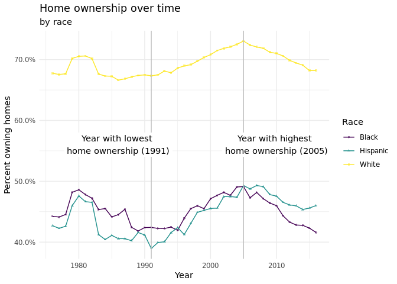
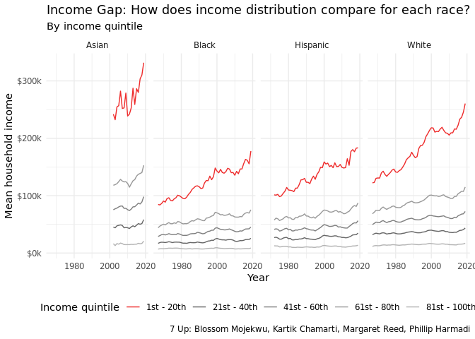
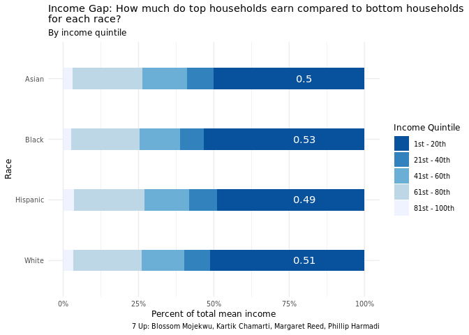

Final Viz
================

``` r
library(tidyverse)
library(viridis)
library(dplyr)
# library(gganimate)
```

``` r
income_mean <- read_csv(file = "../data/income_mean.csv")
home_owner <- read_csv(file = "../data/home_owner.csv")
```

### Question 1

``` r
lowest_year <- home_owner %>%
  group_by(year) %>%
  summarize(mean_pct_unweighted = mean(home_owner_pct)) %>%
  arrange(mean_pct_unweighted) %>%
  slice(1) %>%
  pull(year)
highest_year <- home_owner %>%
  group_by(year) %>%
  summarize(mean_pct_unweighted = mean(home_owner_pct)) %>%
  arrange(desc(mean_pct_unweighted)) %>%
  slice(1) %>%
  pull(year)  
```

#### Plot 1.a

``` r
home_owner %>%
  ggplot(
    aes(x = year, y = home_owner_pct, color = race, shape = race)
  ) +
  geom_line() +
  geom_point(alpha = 0.5, size = 1) +
  geom_vline(aes(xintercept = lowest_year), color = "grey") +
  geom_vline(aes(xintercept = highest_year), color = "grey") +
  geom_label(x = lowest_year - 5, y = 0.56, 
            label = paste0("Year with lowest \nhome ownership (", lowest_year, ")"), 
            color = "black",
            label.size = NA) +
    geom_label(x = highest_year + 5, y = 0.56, 
            label = paste0("Year with highest \nhome ownership (", highest_year, ")"), 
            color = "black",
            label.size = NA) +
  # gganimate::transition_reveal(year) +
  scale_color_viridis_d() +
  labs(
    x = "Year",
    y = "Percent owning homes",
    color = "Race",
    shape = "Race",
    title = "Home ownership over time",
    subtitle = "by race"
  ) +
  theme_minimal() +
  scale_y_continuous(labels = scales::percent_format(scale = 100))
```

<!-- -->

### Question 2

``` r
income_mean <- income_mean %>%
  filter(!str_detect(race, "Combination"),
         !str_detect(race, "Not Hispanic"),
         !str_detect(race, "All"),
         dollar_type == "2019 Dollars",
         income_quintile != "Top 5%") %>%
  group_by(year, race, income_quintile) %>%
  summarize(income_dollars =  mean(income_dollars)) %>%
  mutate(race = str_remove(race, ',?\\s(.*)'),
         income_quintile = ordered(income_quintile, c("Lowest", "Second", 
                                                      "Middle", "Fourth", 
                                                      "Highest")),
      income_percentile = case_when(
      income_quintile == "Top 5%"   ~ "1st - 5th",
      income_quintile == "Highest"  ~ "1st - 20th",
      income_quintile == "Second"   ~ "21st - 40th",
      income_quintile == "Middle"   ~ "41st - 60th",
      income_quintile == "Fourth"   ~ "61st - 80th",
      income_quintile == "Lowest"   ~ "81st - 100th"))
```

    ## `summarise()` has grouped output by 'year', 'race'. You can override using the `.groups` argument.

``` r
highest_perc_table <- income_mean %>%
  filter(year == 2019) %>%
  group_by(race) %>%
  transmute(income_quintile, percent = income_dollars/sum(income_dollars)) %>%
  filter(income_quintile == "Highest")
```

#### Plot 2.a

``` r
income_mean %>%
  ggplot(
    aes(x = year, y = income_dollars, color = income_percentile)
  ) +
  geom_line() +
  facet_wrap(.~race, nrow = 1) +
  scale_y_continuous(labels = scales::label_number(big.mark = ",", 
                                                   scale = 0.001, 
                                                   suffix = "k",
                                                   prefix = "$")) +
  scale_color_manual(values = c("firebrick2", "grey40", "grey50", "grey60", "grey70")) +
  labs(
    title = "Income Gap: How does income distribution compare for each race?",
    subtitle = "By income quintile",
    x = "Year", y = "Mean household income", 
    color = "Income quintile",
    caption = "7 Up: Blossom Mojekwu, Kartik Chamarti, Margaret Reed, Phillip Harmadi"
    ) +
  theme_minimal() +
  theme(legend.position = "bottom")
```

<!-- -->

#### Plot 2.b

``` r
income_mean %>%
  filter(year == 2019) %>%
  ggplot(mapping = aes(x = income_dollars, 
             y = reorder(race, desc(race)),
             width = 0.35)) + 
  geom_bar(position = "fill", stat = "identity", aes(fill = income_percentile)) +
  geom_text(data = highest_perc_table, aes(y = race, label = round(percent, 2)),
            x = 0.8, color = "white") +
  scale_fill_brewer(type = "seq", palette = "Blues", direction = -1) +
  labs(
    title = "Income Gap: How much do top households earn compared to bottom households \nfor each race?",
    subtitle = "By income quintile",
    x = "Percent of total mean income", y = "Race", 
    fill = "Income Quintile",
    caption = "7 Up: Blossom Mojekwu, Kartik Chamarti, Margaret Reed, Phillip Harmadi"
    ) +
  scale_colour_viridis_d() +
  scale_x_continuous(labels = scales::percent_format(scale = 100)) +
  theme_minimal(base_size = 10) +
  theme(text = element_text(size = 9))
```

<!-- -->
