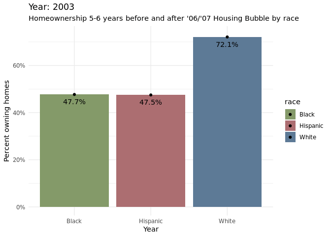

```{r load-packages, include = FALSE}
library(tidyverse)
library(knitr)
library(viridis)
library(xaringanthemer)
library(ggrepel)
library(scales)
library(gganimate)
library(gridExtra)
```

```{r setup, include = FALSE}
# For better figure resolution
knitr::opts_chunk$set(
  fig.retina = 3, 
  dpi = 300, 
  fig.width = 6, 
  fig.asp = 0.618, 
  out.width = "70%"
  )
```

```{r load-data, include = FALSE}
income_mean <- read_csv(file = "../data/income_mean.csv")
home_owner <- read_csv(file = "../data/home_owner.csv")
race_wealth <- read_csv(file = "../data/race_wealth.csv")
```

```{r style-slides, echo = FALSE}
style_xaringan(
  title_slide_background_image = "img/watercolour_sys02_img34_teacup-ocean.jpg"
)
```

Class: middle, inverse, center

### Introduction

Goal: Explore homeownership and wealth inequality in America

Data provided from Urban Institute and US Census through #tidytuesday

---

### Data

```{r housing-data, echo = F}
kable(home_owner %>% slice(1:5))
```


```{r income-data, echo = F}
kable(income_mean %>% slice(1:5))
```


---

### 1. Homeownership Rate and Wealth

- How has home-ownership changed over time?

- How has the '06 - '08 housing crash affected homeownership across racial groups?

```{r find-peaks, include = FALSE}
lowest_year <- home_owner %>%
  group_by(year) %>%
  summarize(mean_pct_unweighted = mean(home_owner_pct)) %>%
  arrange(mean_pct_unweighted) %>%
  slice(1) %>%
  pull(year)
highest_year <- home_owner %>%
  group_by(year) %>%
  summarize(mean_pct_unweighted = mean(home_owner_pct)) %>%
  arrange(desc(mean_pct_unweighted)) %>%
  slice(1) %>%
  pull(year)

last_year <- home_owner %>%
  group_by(race) %>%
  filter(year == max(year))
```

```{r first-look, echo = FALSE, out.width = "60%"}
home_owner %>%
  ggplot(
    aes(x = year, y = home_owner_pct, color = race)
  ) +
  geom_line(size = 1) +
  geom_point(alpha = 0.5, size = 1.5, aes(shape = race)) +
  geom_vline(aes(xintercept = lowest_year), color = "grey") +
  geom_vline(aes(xintercept = highest_year), color = "grey") +
  annotate(geom = "text",
    x = lowest_year - 5, 
    y = 0.56,
    label = paste0("Year with lowest \nhome ownership (", lowest_year, ")"),
    color = "black"
    ) +
  annotate(
    geom = "text",
    x = highest_year + 5, 
    y = 0.56, 
    label = paste0("Year with highest \nhome ownership (", highest_year, ")"), 
    color = "black"
    ) +
  geom_text_repel(
    data = last_year,
    aes(label = race),
    direction = "y",
    nudge_x = 2,
    nudge_y = 0.03,
    size = 4,
    segment.linetype = "dotted"
    ) +
  scale_color_manual(values = c("#859a6a", "#ad6e72", "#5d7a96")) +
  scale_y_continuous(labels = scales::percent_format(scale = 100)) +
  labs(
    x = "Year",
    y = "Percent owning homes",
    color = "Race",
    shape = "Race",
    title = "Home ownership over time",
    subtitle = "by race",
    caption = "7 Up: Blossom Mojekwu, Kartik Chamarti, Margaret Reed, Phillip Harmadi"
  ) +
  theme_minimal() +
  theme(legend.position = "none")
```

---

- How has wealth changed over time?

- How does the growth trend vary between races?

```{r race-wealth, echo = F}
first_year <- race_wealth %>%
  filter(type == "Average",
         race != "Non-White",
         year > 1980) %>%
  group_by(race) %>%
  filter(year == min(year))

race_wealth %>%
  filter(type == "Average",
         race != "Non-White",
         year > 1980) %>%
  drop_na() %>%
  group_by(race, year) %>%
  ggplot(aes(x = year, y = wealth_family, color = race, shape = race)) +
  geom_point(alpha = 0.5, size = 1.5) +
  geom_line(size = 1) +
  geom_text_repel(data = first_year,
                  aes(label = race),
                  direction = "y",
                  nudge_y = 1000,
                  size = 3,
                  segment.linetype = "dotted") +
  geom_vline(aes(xintercept = lowest_year), color = "grey") +
  geom_vline(aes(xintercept = highest_year), color = "grey") +
  scale_color_manual(values = c("#859a6a", "#ad6e72", "#5d7a96")) +
  scale_y_continuous(labels = scales::label_number(big.mark = ",", 
                                                   scale = 0.001, 
                                                   suffix = "k",
                                                   prefix = "$")) +
  labs(
    x = "Year",
    y = "Average wealth per family",
    title = "Average wealth over time",
    subtitle = "by race",
    caption = "Source: U.S. Census 2019 Data"
  ) +
  theme_minimal() +
  theme(legend.position = "none")
```


---

.pull-left[
```{r static-plot-beforeafter-2008, echo = F}
home_owner %>%
  filter(year > "2003", year <= "2010") %>%
  dplyr::group_by(year, race) %>%
  dplyr::summarise(avg_h_o = mean(home_owner_pct), .groups = 'drop') %>%
  ggplot(aes(x = as.factor(year), y = avg_h_o, fill = race)) + 
  geom_bar(width = 0.5, position = "dodge", stat = "identity") +
  geom_hline(aes(yintercept = 0.7207117), linetype = "dashed", alpha = 0.3) +
  geom_hline(aes(yintercept = 0.4816776), linetype = "dashed", alpha = 0.3) +
  geom_hline(aes(yintercept = 0.4930240), linetype = "dashed", alpha = 0.3) +
  scale_y_continuous(labels = scales::percent_format(scale = 100)) +
  coord_flip() +
  scale_fill_manual(values = c("#859a6a", "#ad6e72", "#5d7a96")) +
  labs(
    title = "Homeownership 3 years before and after '06/'07 Housing Bubble",
    y = "Homeownership percentage",
    x = "Year", 
    fill = 'Race'
    ) +
  theme_minimal()
```
]

.pull-right[
```{r animated-plot-pre-post-crash, cache = TRUE, echo = F}

```
]

---

### 2. Household Income 

- How does household income level look like for each racial group over time?

- How do household income disparities compare among different racial groups? 

```{r data-wrangle-2, include = FALSE}
income_mean <- income_mean %>%
  filter(!str_detect(race, "Combination"),
         !str_detect(race, "Not Hispanic"),
         !str_detect(race, "All"),
         dollar_type == "2019 Dollars",
         income_quintile != "Top 5%") %>%
  group_by(year, race, income_quintile) %>%
  summarize(income_dollars =  mean(income_dollars), 
            .groups = "drop") %>%
  mutate(race = str_remove(race, ',?\\s(.*)'),
         income_quintile = ordered(income_quintile, c("Lowest", "Second", 
                                                      "Middle", "Fourth", 
                                                      "Highest")),
      income_percentile = case_when(
        income_quintile == "Top 5%"   ~ "1st - 5th",
        income_quintile == "Highest"  ~ "Top 20%",
        income_quintile == "Fourth"   ~ "21-40 %",
        income_quintile == "Middle"   ~ "41-60 %",
        income_quintile == "Second"   ~ "61-80 %",
        income_quintile == "Lowest"   ~ "Bottom 20%"),
      income_percentile = ordered(income_percentile, 
                                  c("Bottom 20%", "61-80 %", "41-60 %", 
                                    "21-40 %", "Top 20%")),
      race = ordered(race, c("White", "Black", "Hispanic", "Asian")))
```

```{r perc-plot, include = FALSE}
make_perc_table <- function(quintile) {
  return(
    income_mean %>%
      filter(year == 2019) %>%
      group_by(race) %>%
      transmute(income_quintile, 
                percent = income_dollars / sum(income_dollars)) %>%
      filter(income_quintile == quintile)
  )
}

highest_perc_table <- make_perc_table("Highest")
perc_21_40_perc_table <- make_perc_table("Fourth")
perc_41_60_perc_table <- make_perc_table("Middle")
perc_61_80_perc_table <- make_perc_table("Second")
bottom_perc_table <- make_perc_table("Lowest")
```

```{r plot-overtime, echo = FALSE, fig.width = 7, fig.length = 4.2, out.width = "62.5%"}
income_mean %>%
  ggplot(
    aes(
      x = year, 
      y = income_dollars, 
      color = income_percentile
      )
  ) +
  geom_line() +
  facet_wrap(. ~ race, nrow = 1) +
  scale_y_continuous(labels = scales::label_number(big.mark = ",", 
                                                   scale = 0.001, 
                                                   suffix = "k",
                                                   prefix = "$")) +
  scale_color_manual(values = c("grey40", "grey50", "grey60", "grey70", 
                                "firebrick2")) +
  labs(
    title = "Income Gap: How does income distribution compare for each race?",
    subtitle = "per income quintile in time series",
    x = "Year", 
    y = "Mean household income", 
    color = "Income Quintile",
    caption = "Source: U.S. Census 2019 Data"
    ) +
  theme_minimal() +
  theme(
    legend.position = "bottom",
    axis.text.x.bottom = element_text(angle = 90)
    ) +
  guides(color = guide_legend(reverse = TRUE))
```

---

- Which race seems to have the most income inequality within each of their own community?

- How much do the top quintile households earn as compared to the bottom quintile for each race?

```{r plot-bar, echo = FALSE, fig.width = 8, fig.length = 6, out.width = "75%"}
income_mean %>%
  filter(year == 2019) %>%
  ggplot(
    aes(x = income_dollars, y = reorder(race, desc(race)))
    ) + 
  geom_bar(
    position = "fill", 
    stat = "identity", 
    aes(fill = income_percentile),
    width = 0.7
    ) +
  geom_text(
    data = highest_perc_table, 
    aes(y = race, label = paste0(round(percent, 3) * 100)),
    x = 0.45, 
    size = 2.5,
    color = "black",
    nudge_y = -0.45
    ) +
  geom_text(
    data = perc_21_40_perc_table, 
    aes(y = race, label = paste0(round(percent, 3) * 100)),
    x = 0.65, 
    size = 2.5,
    color = "black",
    nudge_y = -0.45
    ) +
  geom_text(
    data = perc_41_60_perc_table, 
    aes(y = race, label = paste0(round(percent, 3) * 100)),
    x = 0.80, 
    size = 2.5,
    color = "black",
    nudge_y = -0.45
    ) +
  geom_text(
    data = perc_61_80_perc_table, 
    aes(y = race, label = paste0(round(percent, 3) * 100)),
    x = 0.92, 
    size = 2.5,
    color = "black",
    nudge_y = -0.45
    ) +
  geom_text(
    data = bottom_perc_table, 
    aes(y = race, label = paste0(round(percent, 3) * 100)),
    x = 0.975, 
    size = 2.5,
    color = "black",
    nudge_y = -0.45
    ) +
  scale_fill_brewer(type = "seq", palette = "Blues", direction = -1) +
  labs(
    title = "Income Gap: How much do top quintile households earn compared to other quintiles?",
    subtitle = "Proportion of income earned for each household quintile per race in 2019",
    x = "Percentage %", 
    y = "Race", 
    fill = "Income Quintile",
    caption = "Source: U.S. Census 2019 Data"
    ) +
  scale_colour_viridis_d() +
  scale_x_continuous(
    labels = scales::label_number(
      big.mark = ",", 
      scale = 100, 
      suffix = "", 
      prefix = ""
      ),
    breaks = seq(-0.2, 1.2, 0.2)
    ) +
  guides(fill = guide_legend(reverse = TRUE)) +
  theme_minimal(base_size = 10) +
  theme(
    text = element_text(size = 9),
    axis.title.x = element_text(vjust = -2),
    plot.caption = element_text(vjust = -3, hjust = 0))
```

---

# Thank You

### Feel free to ask any questions to our team!


